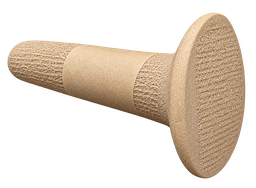

# SikkatuCAD

Мобильный редактор надписей и просмотра чертежей DXF / DWG для Android.
Интерфейс: русский / English / 中文.



## Возможности

- **Открытие и просмотр** чертежей DXF / DWG (конструкции, фасады, планы);
- **Перевод надписей** TEXT / MTEXT / ATTRIB: русский → English / ไทย
  (экспорт текстов в JSON, перевод, импорт обратно в чертёж);
- **Сохранение** в DXF (надёжно) и DWG (экспериментально);
- Замеры: расстояние, угол, площадь;
- Редактирование геометрии: линии, круги, прямоугольники, текст;
- Слои, авто-размеры, PNG-экспорт вида.

## Данные

Приложение **не отправляет данные в интернет**: все операции с чертежами
происходят локально на устройстве. Это можно проверить по исходному коду
(см. ниже).

## Сборка

```bash
cd androidcad
./gradlew assembleDebug
# APK: app/build/outputs/apk/debug/app-debug.apk
```

Требуется Android Studio Hedgehog+ / JDK 17, NDK + Rust для нативного моста:

```bash
cd rust-bridge
cargo build --release --target aarch64-linux-android --lib
# скопировать libcadbridge.so в app/src/main/jniLibs/arm64-v8a/
```

## Лицензия

Код открыт для проверки безопасности, но **не для форка и модификации** —
см. [LICENSE.md](LICENSE.md). Собирайте и используйте без изменений.

Сторонние компоненты — см. [NOTICE.md](NOTICE.md).
